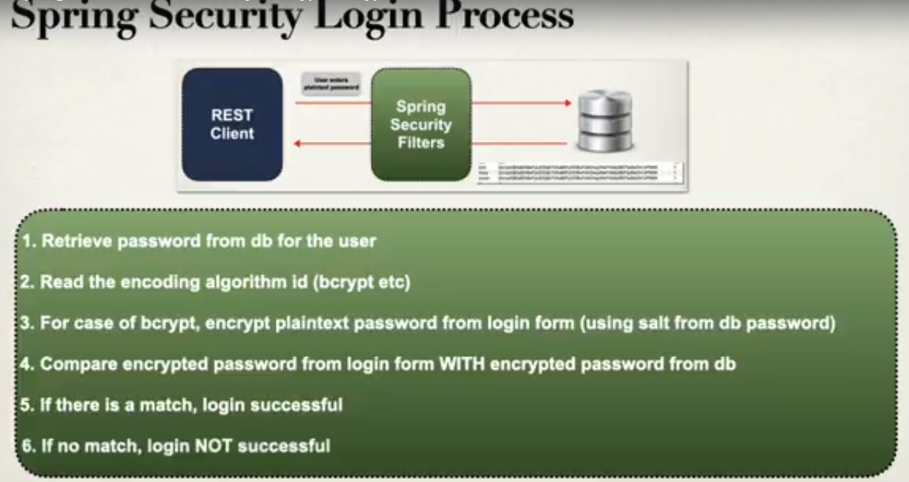

<h1>Overview</h1>

Repository to track development of CRUD API with Spring and SpringBoot

<h2>Notes</h2>

1. <strong>Why do we need Service layer if we have DAO?</strong>  
   
2. <strong>Where should we place Transaction constraint?</strong>  
    The transaction constraint should be placed in Service layer instead of the DAO layer.   
3. <strong>Why is Spring Data JPA used?</strong>  
    Redefining methods of a DAO is kind of a boiler code.  
    JPA is a project in Spring that provides the basic CRUD operations pre-defined, 
    you just need to tell the Entity type and the primary key and use JpaRepository interface.  
    <em>Note: JPA provides Transactional features out of the box, 
        hence we need not use Transactional in our Service class for a single entity</em>   
4. <strong>Spring Security Basics</strong>  
    a. To include Spring security in our project, we need to add dependency for spring security.  
    <pre>Example:
        &lt;dependency&gt;
           &lt;groupId>org.springframework.boot&lt;/groupId&gt;
           &lt;artifactId>spring-boot-starter-security&lt;/artifactId&gt;
        &lt;/dependency&gt;</pre> 
    b. By default, post inclusion of Spring security, all endpoints are secured by default.  
    c. The default username for the application is <code>user</code>.  
    d. The default password for the application appears in the console during application startup.  
    e. To override the default username and password, we need to update properties in application.properties file.  
    <pre>Example:
        spring.security.user.name=faizan
        spring.security.user.password=pass</pre>  
5. <strong>Creating Users With Roles</strong>  
    Once we create roles, the default roles in application.properties or generated default user role do not work.  
    To create roles, once can use Configuration class with Bean definition that can return any <code>UserDetailsManager</code>  
    <pre>Example:
        @Configuration
        public class DemoSecurityConfig {
        
            @Bean
            public InMemoryUserDetailsManager userDetailsManager() {
        
                // Password follows {id}pass format where {noop} means storing password in plain text
        
                UserDetails john = User.builder()
                        .username("john")
                        .password("{noop}test123")
                        .roles("EMPLOYEE")
                        .build();
        
                ...
                
                return new InMemoryUserDetailsManager(john, mary, susan);
            }
        
        }</pre>
    The default Authorization type used by Spring Security is <code>Basic Auth</code>   
6. <strong>Spring Security with JDBC</strong>  
    By default Spring Security will read and create users and assign roles if we use the following schema  
    <pre>CREATE TABLE `users` (
        `username` varchar(50) NOT NULL,
        `password` varchar(50) NOT NULL,
        `enabled` tinyint NOT NULL,
        PRIMARY KEY (`username`)
    ) ENGINE=InnoDB DEFAULT CHARSET=latin1;
   
    CREATE TABLE `authorities` (
        `username` varchar(50) NOT NULL,
        `authority` varchar(50) NOT NULL,
        UNIQUE KEY `authorities_idx_1` (`username`,`authority`),
        CONSTRAINT `authorities_ibfk_1` FOREIGN KEY (`username`) REFERENCES `users` (`username`)
    ) ENGINE=InnoDB DEFAULT CHARSET=latin1; </pre>
   
    <em>Note: The authority should have prefix of <code>ROLE_</code> which helps Spring security assign the roles.</em>  
    <pre>Example: 
        INSERT INTO `authorities` 
        VALUES
        ('john','ROLE_EMPLOYEE'),
        ('mary','ROLE_EMPLOYEE'),
        ('mary','ROLE_MANAGER'),
        ('susan','ROLE_EMPLOYEE'),
        ('susan','ROLE_MANAGER'),
        ('susan','ROLE_ADMIN');</pre>
    <em>Note: Spring hits the DB for each login request, hence latest information from DB will be used without app restart.</em>   
7. <strong>Spring Security Login Process</strong>  
   
8. Checkout [feat/security-custom-tables](https://github.com/faizansaghir/crudProjectInSpringBoot/tree/feat/security-custom-tables) for example of Spring Security with custom tables   
