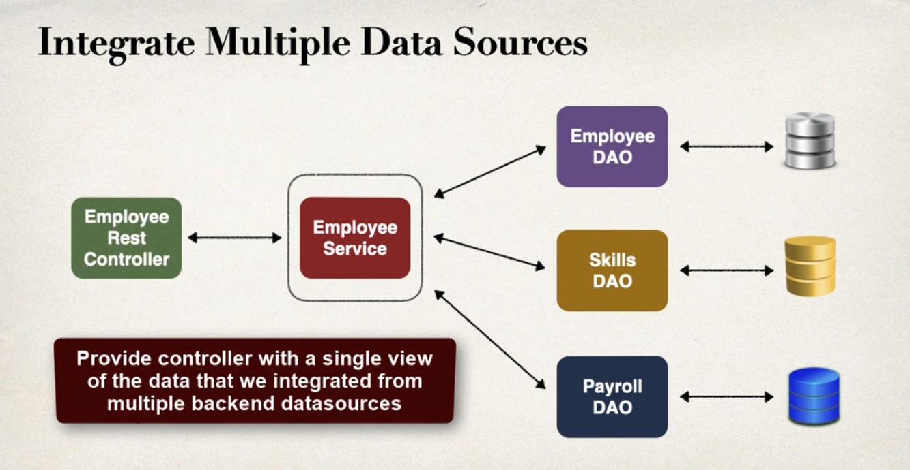

<h1>Overview</h1>
Repository to track development of CRUD API with Spring and SpringBoot

<h2>Notes</h2>
1. <strong>Why do we need Service layer if we have DAO?</strong>  
       
2. <strong>Where should we place Transaction constraint?</strong>  
    The transaction constraint should be placed in Service layer instead of the DAO layer.   
